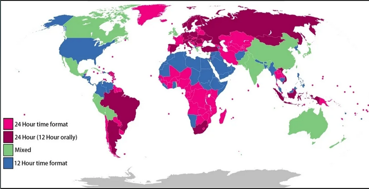
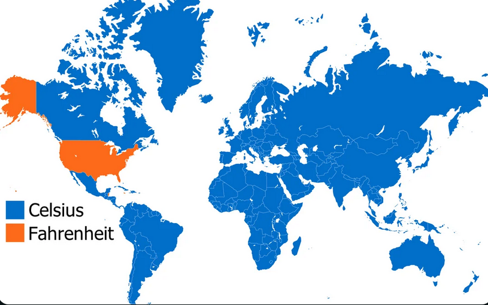

# OVOS Language Support Tracker

**Your help with translations is invaluable!**

> You can find us on [Gitlocalize](https://gitlocalize.com/users/OpenVoiceOS), a text and video translation tutorial is available at [https://www.openvoiceos.org/translation](https://www.openvoiceos.org/translation)

## Translations Status

translation status from our [Gitlocalize](https://gitlocalize.com/users/OpenVoiceOS) platform are available with detailed stats per repository. 

The table below lists languages that are at least 25% translated, note that these numbers may decrease whenever new strings become available for translation

____

| Lang | Translated % |
| --- | --- |
| da | 0.99 |
| de-DE | 0.91 |
| ca | 0.9 |
| pt-PT | 0.66 |
| gl | 0.66 |
| it-IT | 0.6 |
| eu | 0.43 |
| fr-FR | 0.43 |
| nl-NL | 0.4 |
| es-ES | 0.36 |

____

## Open Data

benchmark explorers:
- [meteocat](https://meteocat.bench.tigregotico.pt) - catalan benchmark for weather queries
- [gitlocalize-bench](https://gitlocalize-bench.tigregotico.pt/) - padatious benchmark to evaluate gitlocalize intents
- [stt-bench](https://stt-bench.tigregotico.pt) - evaluating STT plugins against various datasets
- [tts-bench](https://tts-bench.tigregotico.pt) - evaluating TTS plugins

json dumps for gitlocalize translation stats:
- [ca-ES.json](tx_info/ca.json)
- [da-DK.json](tx_info/da.json)
- [de-DE.json](tx_info/de-DE.json)
- [es-ES.json](tx_info/es-ES.json)
- [eu.json](tx_info/eu.json)
- [fr-FR.json](tx_info/fr-FR.json)
- [gl-ES.json](tx_info/gl.json)
- [it-IT.json](tx_info/it-IT.json)
- [nl-NL.json](tx_info/nl-NL.json)
- [pt-PT.json](tx_info/pt-PT.json)

per language translation overview in markdown format:
- [translate_status_ca.md](tx_info/translate_status_ca.md)
- [translate_status_da.md](tx_info/translate_status_da.md)
- [translate_status_de.md](tx_info/translate_status_de-DE.md)
- [translate_status_es.md](tx_info/translate_status_es-ES.md)
- [translate_status_eu.md](tx_info/translate_status_eu.md)
- [translate_status_fr.md](tx_info/translate_status_fr-FR.md)
- [translate_status_gl.md](tx_info/translate_status_gl.md)
- [translate_status_it.md](tx_info/translate_status_it-IT.md)
- [translate_status_nl.md](tx_info/translate_status_nl-NL.md)
- [translate_status_pt.md](tx_info/translate_status_pt-PT.md)

---

## RaspOVOS Language Comparison

- 🌟 **Best**: Fully offline (STT, TTS, wake words).
- ✅ **Good**: Online STT + Offline TTS.
- ⚡ **Usable**: Online STT + Online TTS.
- 🛠️ **Work in Progress**: Missing key functionality or early-stage development.

| **Language**   | **STT**                                                  | **TTS**                                          | **Wake Word**                                  | **"Wake Up" Hotword**                    | **Notes**                                                                                                                                                                                                                                             | **Rating**               |
|----------------|----------------------------------------------------------|--------------------------------------------------|------------------------------------------------|------------------------------------------|-------------------------------------------------------------------------------------------------------------------------------------------------------------------------------------------------------------------------------------------------------|--------------------------|
| **English**    | `ovos-stt-plugin-server` Whisper Turbo public servers | `ovos-tts-plugin-piper` voice-en-gb-alan-low  | `ovos-ww-plugin-precise-lite` "hey mycroft" | `ovos-ww-plugin-vosk` "wake up"       | - STT relies on public servers                                                                                                                                                                                                                        | ✅  **Good**              |
| **Catalan**    | `ovos-stt-plugin-citrinet` AINA Citrinet model        | `ovos-tts-plugin-matxa` MatxaTTS              | `ovos-ww-plugin-precise-lite` "hey mycroft" | `ovos-ww-plugin-vosk` "desperta"      | - Fully offline; supports Catalan-specific models for STT and TTS.                                                                                                                                  | 🌟  **Best**             |
| **German**     | `ovos-stt-plugin-citrinet` Nemo Citrinet model        | `ovos-tts-plugin-piper` thorsten-low          | `ovos-ww-plugin-precise-lite` "hey mycroft" | `ovos-ww-plugin-vosk` "aufwachen"     | - Citrinet is not very good                                                                                                                                                                          | 🌟  **Best**             |
| **Portuguese** | `ovos-stt-plugin-server` MyNorthAI public servers     | `ovos-tts-plugin-edge-tts` pt-PT-DuarteNeural | `ovos-ww-plugin-precise-lite` "hey mycroft" | `ovos-ww-plugin-vosk` "acorda"        | - STT relies on public servers - Edge TTS is temporary (not privacy respecting).  - 🚧 Skills translation is a work in progress                                                                                                                 | 🛠️ **Work in Progress** |
| **Spanish**    | `ovos-stt-plugin-citrinet` NVIDIA Citrinet model      | `ovos-tts-plugin-ahotts` spanish              | `ovos-ww-plugin-precise-lite` "hey mycroft" | `ovos-ww-plugin-vosk` "despierta"     | - 🚧 Skills translation is a work in progress                                                                                                                                                                                                         | 🛠️ **Work in Progress**             |
| **Galician**   | `ovos-stt-plugin-server` Whisper Turbo public servers | `ovos-tts-plugin-nos` NOS TTS                 | `ovos-ww-plugin-precise-lite` "hey mycroft" | `ovos-ww-plugin-vosk` "acorda"        | - STT relies on public servers  - 🚧 "wake up" does not have dedicated galician vosk model   - ⚠️ might be hard to get out of sleep mode! (portuguese model) - 🚧 Skills translation is a work in progress                                   | 🛠️ **Work in Progress**             |
| **Basque**     | `ovos-stt-plugin-server` Whisper Turbo public servers | `ovos-tts-plugin-ahotts` basque               | `ovos-ww-plugin-precise-lite` "hey mycroft" | `ovos-ww-plugin-vosk` "esnatu"        | - STT relies on public servers -🚧 "wake up" does not have dedicated basque vosk model  - ⚠️ might be hard to get out of sleep mode! (spanish model) - 🚧 Skills translation is a work in progress |🛠️ **Work in Progress**              |
| **Dutch**      | `ovos-stt-plugin-citrinet` Nemo Citrinet model        | `ovos-tts-plugin-piper` mls_5809-low          | `ovos-ww-plugin-precise-lite` "hey mycroft" | `ovos-ww-plugin-vosk` "wakker worden" | - Citrinet is not very good - 🚧 Skills translation is a work in progress                                                                                                                                                                                                         | 🛠️ **Work in Progress**             |

---

## Info Maps

Clock format per country (12 vs 24h)

Date format per country

System units per country

Temperature units per country

