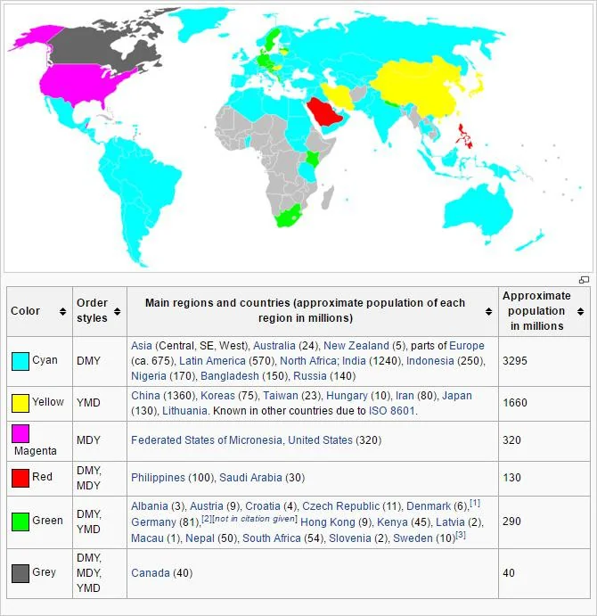
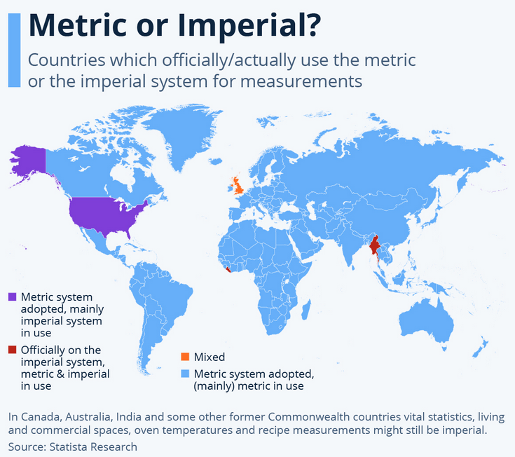

this repo provides config snippets for OVOS

there are 4 folders, each containing a config file optimized for each language

this includes default plugins and other settings such as units and date format
```
.
├── offline_female
│   ├── ca-es.conf
│   ├── de-de.conf
│   ├── en-gb.conf
│   ├── en-us.conf
│   ├── es-es.conf
│   ├── fr-fr.conf
│   ├── gl-es.conf
│   ├── it-it.conf
│   └── nl-nl.conf
├── offline_male
│   ├── ca-es.conf
│   ├── de-de.conf
│   ├── en-gb.conf
│   ├── en-us.conf
│   ├── es-es.conf
│   ├── fr-fr.conf
│   ├── gl-es.conf
│   ├── it-it.conf
│   ├── nl-nl.conf
│   ├── pt-br.conf
│   └── pt-pt.conf
├── online_female
│   ├── ca-ba.conf
│   ├── ca-es.conf
│   ├── ca-nw.conf
│   ├── ca-va.conf
│   ├── de-de.conf
│   ├── en-gb.conf
│   ├── en-us.conf
│   ├── es-es.conf
│   ├── fr-fr.conf
│   ├── it-it.conf
│   └── nl-nl.conf
└── online_male
    ├── ca-ba.conf
    ├── ca-es.conf
    ├── ca-nw.conf
    ├── ca-va.conf
    ├── de-de.conf
    ├── en-gb.conf
    ├── en-us.conf
    ├── es-es.conf
    ├── fr-fr.conf
    ├── it-it.conf
    ├── nl-nl.conf
    ├── pt-br.conf
    └── pt-pt.conf

```
PRs welcome!

## Info Maps

Date format per country


System units per country
