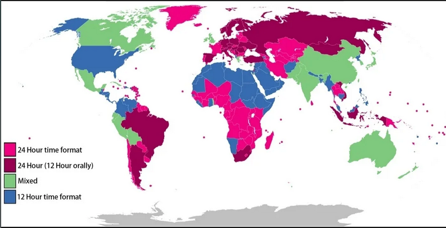
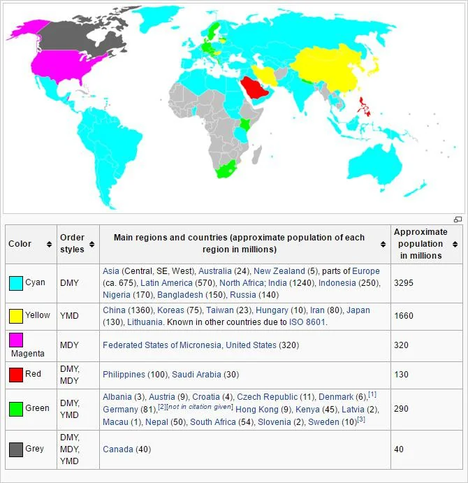
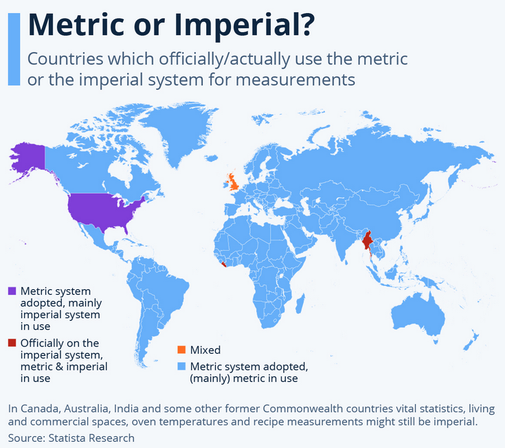

# OVOS Language Support Tracker

**Your help with translations is invaluable!**

> You can find us on [Gitlocalize](https://gitlocalize.com/users/OpenVoiceOS), a text and video translation tutorial is available at [https://www.openvoiceos.org/translation](https://www.openvoiceos.org/translation)

## Translations Status

translation status from our [Gitlocalize](https://gitlocalize.com/users/OpenVoiceOS) platform are available with detailed stats per repository. 

The table below lists languages that are at least 25% translated, note that these numbers may decrease whenever new strings become available for translation


____

| Lang | Translated % |
| --- | --- |
| de-DE | 0.93 |
| ca | 0.91 |
| da | 0.91 |
| gl | 0.7 |
| pt-PT | 0.62 |
| it-IT | 0.53 |
| es-ES | 0.46 |
| eu | 0.4 |
| fr-FR | 0.39 |
| nl-NL | 0.35 |


____


## 📢 **Language Support in OVOS Needs Your Help!**

Hey OVOS community! 🚀

If you’re using **raspOVOS** or any OVOS installation, we need **real-world data** to improve performance! 🫵

- 🟢 **[GitLocalize Benchmarks](https://gitlocalize-bench.tigregotico.pt/)** show between **70%** and **90%+ accuracy** depending on language
- 🔴 **User Reports** from the latest **raspOVOS images** indicate **high intent failure rates** in real use!

This gap shows why **training data alone isn’t enough**—we need **fresh test data** to:

- 🛠 Identify **intent failures** in daily usage
- 🗣 Spot **translation mistakes** affecting accuracy
- 📊 Improve **models & pipelines**

### **🌍 How to Help?**

1️⃣ **Enable Open Data Collection in raspOVOS (or your OVOS instance)**

- Add this to your `mycroft.conf`:

```json
"open_data": {
  "intent_urls": [
    "https://metrics.tigregotico.pt/intents"
  ]
}
```

_(Or self-host to track your own assistant’s failed intents! 🔧 [More info](https://github.com/OpenVoiceOS/ovos-opendata-server))_

2️⃣ **Monitor Progress & Data Collection:**

- 📊 **Live Dashboard:** [opendata.tigregotico.pt](https://opendata.tigregotico.pt/)
- ✅ **Server Status:** [metrics.tigregotico.pt/status](https://metrics.tigregotico.pt/status)


> OVOS is getting **more users**, but **without native speakers contributing real data, accuracy will suffer!**

Thanks for your help! Let’s make OVOS **great for every language** together! 🚀💙

____


## Open Data

benchmark explorers:
- [meteocat](https://meteocat.bench.tigregotico.pt) - catalan benchmark for weather queries
- [gitlocalize-bench](https://gitlocalize-bench.tigregotico.pt/) - padatious benchmark to evaluate gitlocalize intents
- [stt-bench](https://stt-bench.tigregotico.pt) - evaluating STT plugins against various datasets
- [tts-bench](https://tts-bench.tigregotico.pt) - evaluating TTS plugins

json dumps for gitlocalize translation stats:
- [ca-ES.json](tx_info/ca.json)
- [da-DK.json](tx_info/da.json)
- [de-DE.json](tx_info/de-DE.json)
- [es-ES.json](tx_info/es-ES.json)
- [eu.json](tx_info/eu.json)
- [fr-FR.json](tx_info/fr-FR.json)
- [gl-ES.json](tx_info/gl.json)
- [it-IT.json](tx_info/it-IT.json)
- [nl-NL.json](tx_info/nl-NL.json)
- [pt-PT.json](tx_info/pt-PT.json)

per language translation overview in markdown format:
- [translate_status_ca.md](tx_info/translate_status_ca.md)
- [translate_status_da.md](tx_info/translate_status_da.md)
- [translate_status_de.md](tx_info/translate_status_de-DE.md)
- [translate_status_es.md](tx_info/translate_status_es-ES.md)
- [translate_status_eu.md](tx_info/translate_status_eu.md)
- [translate_status_fr.md](tx_info/translate_status_fr-FR.md)
- [translate_status_gl.md](tx_info/translate_status_gl.md)
- [translate_status_it.md](tx_info/translate_status_it-IT.md)
- [translate_status_nl.md](tx_info/translate_status_nl-NL.md)
- [translate_status_pt.md](tx_info/translate_status_pt-PT.md)

---


## Recommended Plugins per Language

> 🚧 - this section is still under construction

**Generic Recommendations**

| Configuration                       | STT Plugin / Model                                                                           | TTS Plugin / Model                                                                                                      |
|-------------------------------------|----------------------------------------------------------------------------------------------|-------------------------------------------------------------------------------------------------------------------------|
| Online STT + Online TTS             | **plugin**: `ovos-stt-plugin-server`<br>**url**:<br>-`https://stt.smartgic.io/fasterwhisper` | **plugin**: `ovos-tts-plugin-server`<br>**url**:<br>-`https://tts.smartgic.io/piper`<br>-`https://piper.tigregotico.pt` | 
| Online STT + Offline TTS            | **plugin**: `ovos-stt-plugin-server`<br>**url**:<br>-`https://stt.smartgic.io/fasterwhisper` | **plugin**: `ovos-tts-plugin-piper`                                                                                     |
| Offline STT + Offline TTS (CPU)     | **plugin**: `ovos-stt-plugin-citrinet`                                                       | **plugin**: `ovos-tts-plugin-piper`                                                                                     |
| Offline STT + Offline TTS (**GPU**) | **plugin**: `ovos-stt-plugin-whisper`<br> **model**:`whisper-large-v3-turbo`                 | **plugin**: `ovos-tts-plugin-piper`                                                                                     | 

**English**

| Configuration                       | STT Plugin / Model                                                                                 | TTS Plugin / Model (Male)                                                                                               | TTS Plugin / Model (Female)                                                                                             |
|-------------------------------------|----------------------------------------------------------------------------------------------------|-------------------------------------------------------------------------------------------------------------------------|-------------------------------------------------------------------------------------------------------------------------|
| Online STT + Online TTS             | **plugin**: `ovos-stt-plugin-server`<br>**url**:<br>-`https://stt.smartgic.io/fasterwhisper`       | **plugin**: `ovos-tts-plugin-server`<br>**url**:<br>-`https://tts.smartgic.io/piper`<br>-`https://piper.tigregotico.pt` | **plugin**: `ovos-tts-plugin-server`<br>**url**:<br>-`https://tts.smartgic.io/piper`<br>-`https://piper.tigregotico.pt` |
| Online STT + Offline TTS            | **plugin**: `ovos-stt-plugin-server`<br>**url**:<br>-`https://stt.smartgic.io/fasterwhisper`       | **plugin**: `ovos-tts-plugin-piper`<br>**model**:`voice-en-gb-alan-low`                                                 | **plugin**: `ovos-tts-plugin-piper`<br>**model**:N/A                                                                    |
| Offline STT + Offline TTS (CPU)     | **plugin**: `ovos-stt-plugin-citrinet`<br>**model**: `neongeckocom/stt_en_citrinet_512_gamma_0_25` | **plugin**: `ovos-tts-plugin-piper`<br>**model**:`voice-en-gb-alan-low`                                                 | **plugin**: `ovos-tts-plugin-piper`<br>**model**:N/A                                                                    |
| Offline STT + Offline TTS (**GPU**) | **plugin**: `ovos-stt-plugin-fasterwhisper`<br> **model**:`whisper-large-v3-turbo`                 | **plugin**: `ovos-tts-plugin-piper`<br>**model**:`voice-en-gb-alan-low`                                                 | **plugin**: `ovos-tts-plugin-piper`<br>**model**:N/A                                                                    |

**Catalan**

| Configuration                       | STT Plugin / Model                                                                                | TTS Plugin / Model (Male)                                                                                                                              | TTS Plugin / Model (Female)                                                                                                                            |
|-------------------------------------|---------------------------------------------------------------------------------------------------|--------------------------------------------------------------------------------------------------------------------------------------------------------|--------------------------------------------------------------------------------------------------------------------------------------------------------|
| Online STT + Online TTS             | **plugin**: `ovos-stt-plugin-server`<br>**url**:<br>-`https://stt.smartgic.io/fasterwhisper`      | **plugin**: `ovos-tts-plugin-server`<br>**url**:<br>-`https://tts.smartgic.io/matxa`<br>-`https://matxa.tigregotico.pt`                                | **plugin**: `ovos-tts-plugin-server`<br>**url**:<br>-`https://tts.smartgic.io/matxa`<br>-`https://matxa.tigregotico.pt`                                |
| Online STT + Offline TTS            | **plugin**: `ovos-stt-plugin-server`<br>**url**:<br>-`https://stt.smartgic.io/fasterwhisper`      | **plugin**: `ovos-tts-plugin-matxa-multispeaker-cat`<br>**model**:<br>-`balear/quim`<br>-`central/grau`<br>-`nord-occidental/pere`<br>-`valencia/lluc` | **plugin**: `ovos-tts-plugin-matxa-multispeaker-cat`<br>**model**:<br>-`balear/olga`<br>-`central/elia`<br>-`nord-occidental/emma`<br>-`valencia/gina` |
| Offline STT + Offline TTS (CPU)     | **plugin**: `ovos-stt-plugin-citrinet`<br>**model**:`projecte-aina/stt-ca-citrinet-512`           | **plugin**: `ovos-tts-plugin-matxa-multispeaker-cat`<br>**model**:<br>-`balear/quim`<br>-`central/grau`<br>-`nord-occidental/pere`<br>-`valencia/lluc` | **plugin**: `ovos-tts-plugin-matxa-multispeaker-cat`<br>**model**:<br>-`balear/olga`<br>-`central/elia`<br>-`nord-occidental/emma`<br>-`valencia/gina` |
| Offline STT + Offline TTS (**GPU**) | **plugin**: `ovos-stt-plugin-whisper`<br> **model**:`projecte-aina/whisper-large-v3-ca-3catparla` | **plugin**: `ovos-tts-plugin-matxa-multispeaker-cat`<br>**model**:<br>-`balear/quim`<br>-`central/grau`<br>-`nord-occidental/pere`<br>-`valencia/lluc` | **plugin**: `ovos-tts-plugin-matxa-multispeaker-cat`<br>**model**:<br>-`balear/olga`<br>-`central/elia`<br>-`nord-occidental/emma`<br>-`valencia/gina` |

**Galician**

| Configuration                       | STT Plugin / Model                                                                                 | TTS Plugin / Model (Male) | TTS Plugin / Model (Female)                                                                                         |
|-------------------------------------|----------------------------------------------------------------------------------------------------|---------------------------|---------------------------------------------------------------------------------------------------------------------|
| Online STT + Online TTS             | **plugin**: `ovos-stt-plugin-server`<br>**url**:<br>-`https://stt.smartgic.io/fasterwhisper`       | N/A                       | **plugin**: `ovos-tts-plugin-server`<br>**url**:<br>-`https://tts.smartgic.io/nos`<br>-`https://nos.tigregotico.pt` |
| Online STT + Offline TTS            | **plugin**: `ovos-stt-plugin-server`<br>**url**:<br>-`https://stt.smartgic.io/fasterwhisper`       | N/A                       | **plugin**: `ovos-tts-plugin-nos`<br>**model**:`celtia`                                                             |
| Offline STT + Offline TTS (CPU)     | **plugin**: `ovos-stt-plugin-fasterwhisper`<br>**model**:`Jarbas/faster-whisper-small-gl-cv13`     | N/A                       | **plugin**: `ovos-tts-plugin-nos`<br>**model**:`celtia`                                                             |
| Offline STT + Offline TTS (**GPU**) | **plugin**: `ovos-stt-plugin-fasterwhisper`<br> **model**:`Jarbas/faster-whisper-large-v2-gl-cv13` | N/A                       | **plugin**: `ovos-tts-plugin-nos`<br>**model**:`celtia`                                                             |

**Basque**

| Configuration                       | STT Plugin / Model                                                                             | TTS Plugin / Model (Male) | TTS Plugin / Model (Female)                            |
|-------------------------------------|------------------------------------------------------------------------------------------------|---------------------------|--------------------------------------------------------|
| Online STT + Online TTS             | **plugin**: `ovos-stt-plugin-server`<br>**url**:<br>-`https://stt.smartgic.io/fasterwhisper`   | N/A                       | N/A                                                    |
| Online STT + Offline TTS            | **plugin**: `ovos-stt-plugin-server`<br>**url**:<br>-`https://stt.smartgic.io/fasterwhisper`   | N/A                       | **plugin**: `ovos-tts-plugin-ahotts`<br>**model**:`eu` |
| Offline STT + Offline TTS (CPU)     | **plugin**: `ovos-stt-plugin-fasterwhisper`<br>**model**:`Jarbas/faster-whisper-small-eu-cv16` | N/A                       | **plugin**: `ovos-tts-plugin-ahotts`<br>**model**:`eu` |
| Offline STT + Offline TTS (**GPU**) | **plugin**: `ovos-stt-plugin-HiTZ`<br> **model**:`stt_eu_conformer_transducer_large`           | N/A                       | **plugin**: `ovos-tts-plugin-ahotts`<br>**model**:`eu` |

**Spanish**

| Configuration                       | STT Plugin / Model                                                                           | TTS Plugin / Model (Male)                                                                                               | TTS Plugin / Model (Female)                                                                                             |
|-------------------------------------|----------------------------------------------------------------------------------------------|-------------------------------------------------------------------------------------------------------------------------|-------------------------------------------------------------------------------------------------------------------------|
| Online STT + Online TTS             | **plugin**: `ovos-stt-plugin-server`<br>**url**:<br>-`https://stt.smartgic.io/fasterwhisper` | **plugin**: `ovos-tts-plugin-server`<br>**url**:<br>-`https://tts.smartgic.io/piper`<br>-`https://piper.tigregotico.pt` | **plugin**: `ovos-tts-plugin-server`<br>**url**:<br>-`https://tts.smartgic.io/piper`<br>-`https://piper.tigregotico.pt` |
| Online STT + Offline TTS            | **plugin**: `ovos-stt-plugin-server`<br>**url**:<br>-`https://stt.smartgic.io/fasterwhisper` | N/A                                                                                                                     | N/A                                                                                                                     |
| Offline STT + Offline TTS (CPU)     | **plugin**: `ovos-stt-plugin-citrinet`<br>**model**: `Jarbas/stt_es_citrinet_512_onnx`       | N/A                                                                                                                     | N/A                                                                                                                     |
| Offline STT + Offline TTS (**GPU**) | **plugin**: `ovos-stt-plugin-fasterwhisper`<br> **model**:`whisper-large-v3-turbo`           | N/A                                                                                                                     | N/A                                                                                                                     |

---


## RaspOVOS Language Comparison

- 🌟 **Best**: Fully offline (STT, TTS, wake words).
- ✅ **Good**: Online STT + Offline TTS.
- ⚡ **Usable**: Online STT + Online TTS.
- 🛠️ **Work in Progress**: Missing key functionality or early-stage development.

| **Language**   | **STT**                                                  | **TTS**                                          | **Wake Word**                                  | **"Wake Up" Hotword**                    | **Notes**                                                                                                                                                                                                                                             | **Rating**               |
|----------------|----------------------------------------------------------|--------------------------------------------------|------------------------------------------------|------------------------------------------|-------------------------------------------------------------------------------------------------------------------------------------------------------------------------------------------------------------------------------------------------------|--------------------------|
| **English**    | `ovos-stt-plugin-server`<br>Whisper Turbo public servers | `ovos-tts-plugin-piper`<br>voice-en-gb-alan-low  | `ovos-ww-plugin-precise-lite`<br>"hey mycroft" | `ovos-ww-plugin-vosk`<br>"wake up"       | - STT relies on public servers                                                                                                                                                                                                                        | ✅  **Good**              |
| **Catalan**    | `ovos-stt-plugin-citrinet`<br>AINA Citrinet model        | `ovos-tts-plugin-matxa`<br>MatxaTTS              | `ovos-ww-plugin-precise-lite`<br>"hey mycroft" | `ovos-ww-plugin-vosk`<br>"desperta"      | - Fully offline; supports Catalan-specific models for STT and TTS.                                                                                                                                  | 🌟  **Best**             |
| **German**     | `ovos-stt-plugin-citrinet`<br>Nemo Citrinet model        | `ovos-tts-plugin-piper`<br>thorsten-low          | `ovos-ww-plugin-precise-lite`<br>"hey mycroft" | `ovos-ww-plugin-vosk`<br>"aufwachen"     | - Citrinet is not very good                                                                                                                                                                          | 🌟  **Best**             |
| **Portuguese** | `ovos-stt-plugin-server`<br>MyNorthAI public servers     | `ovos-tts-plugin-edge-tts`<br>pt-PT-DuarteNeural | `ovos-ww-plugin-precise-lite`<br>"hey mycroft" | `ovos-ww-plugin-vosk`<br>"acorda"        | - STT relies on public servers<br>- Edge TTS is temporary (not privacy respecting). <br>- 🚧 Skills translation is a work in progress                                                                                                                 | 🛠️ **Work in Progress** |
| **Spanish**    | `ovos-stt-plugin-citrinet`<br>NVIDIA Citrinet model      | `ovos-tts-plugin-ahotts`<br>spanish              | `ovos-ww-plugin-precise-lite`<br>"hey mycroft" | `ovos-ww-plugin-vosk`<br>"despierta"     | - 🚧 Skills translation is a work in progress                                                                                                                                                                                                         | 🛠️ **Work in Progress**             |
| **Galician**   | `ovos-stt-plugin-server`<br>Whisper Turbo public servers | `ovos-tts-plugin-nos`<br>NOS TTS                 | `ovos-ww-plugin-precise-lite`<br>"hey mycroft" | `ovos-ww-plugin-vosk`<br>"acorda"        | - STT relies on public servers <br>- 🚧 "wake up" does not have dedicated galician vosk model <br> - ⚠️ might be hard to get out of sleep mode! (portuguese model)<br>- 🚧 Skills translation is a work in progress                                   | 🛠️ **Work in Progress**             |
| **Basque**     | `ovos-stt-plugin-server`<br>Whisper Turbo public servers | `ovos-tts-plugin-ahotts`<br>basque               | `ovos-ww-plugin-precise-lite`<br>"hey mycroft" | `ovos-ww-plugin-vosk`<br>"esnatu"        | - STT relies on public servers<br>-🚧 "wake up" does not have dedicated basque vosk model <br>- ⚠️ might be hard to get out of sleep mode! (spanish model)<br>- 🚧 Skills translation is a work in progress |🛠️ **Work in Progress**              |
| **Dutch**      | `ovos-stt-plugin-citrinet`<br>Nemo Citrinet model        | `ovos-tts-plugin-piper`<br>mls_5809-low          | `ovos-ww-plugin-precise-lite`<br>"hey mycroft" | `ovos-ww-plugin-vosk`<br>"wakker worden" | - Citrinet is not very good<br>- 🚧 Skills translation is a work in progress                                                                                                                                                                                                         | 🛠️ **Work in Progress**             |

---

## Info Maps

Clock format per country (12 vs 24h)



Date format per country



System units per country



Temperature units per country


